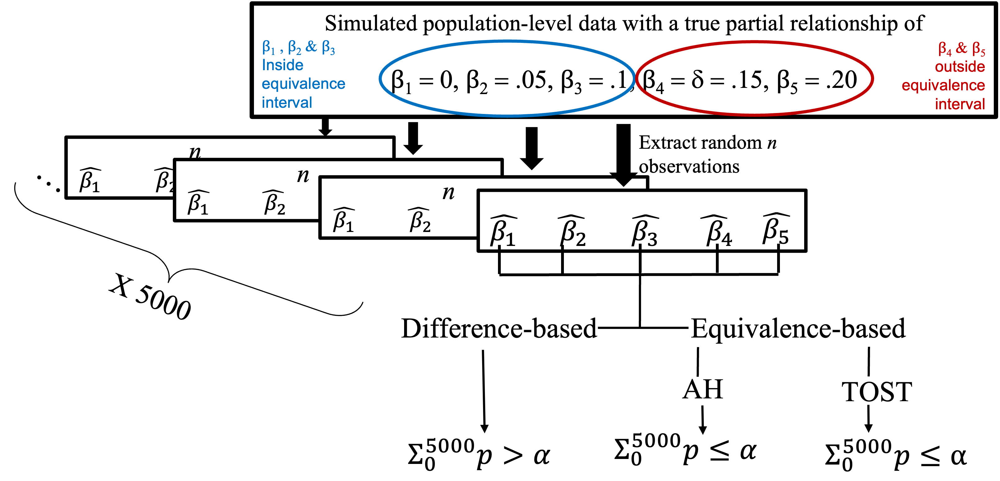

```{r setup, include=FALSE}
library(flexdashboard)
library(magrittr)
library(simglm)
library(tidyverse)
library(haven)
library(hrbrthemes)
library(plotly)
library(greekLetters)
library(MetBrewer)
library(datapasta)
library(DT)
library(rmdformats)
library(knitr)
library(tidyverse)
library(plotly)
library(readxl)
library(plotly)
library(MetBrewer)
library(gganimate)

```

```{r initial data, include=FALSE}

simresults <- read_excel("~/Google Drive/My Drive/Master's thesis/TQMP submission/Round 1/Final/Full_results_from_SimDesign_Correlations DEC26.xlsx")

#View(simresults)
simresults["beta"][simresults["beta"] == 1] <- 0
simresults["beta"][simresults["beta"] == 2] <- 0.05
simresults["beta"][simresults["beta"] == 3] <- 0.1
simresults["beta"][simresults["beta"] == 4] <- 0.15
simresults["beta"][simresults["beta"] == 5] <- 0.2
simresults$cors <- factor(simresults$cors)
simresults$label <- paste("β =", as.character(simresults$beta))


sim <- simresults |> dplyr::select(N:REPLICATIONS, SEED)

colnames(sim) <- c("N", "Test type", "Effect size (β)", "Correlation coefficient", "Proportion of negligible effect conclusions", "Number of replications", "Seed")
```

Paper Highlights {data-icon="fa-highlighter"}
=============================

Inputs {.sidebar data-width=300}
-------------------------------------
<b>Abstract</b>  <br>
Psychological research is rife with inappropriately concluding “no effect” between predictors and outcome in regression models following statistically nonsignificant results. However, this approach is methodologically flawed because failing to reject the null hypothesis using traditional, difference-based tests does not mean the null is true. Using this approach leads to high rates of incorrect conclusions that flood psychological literature. This paper introduces a novel, methodologically sound alternative. In this paper, we demonstrate how an equivalence testing approach can be applied to multiple regression (which we refer to here as “negligible effect testing”) to evaluate whether a predictor (measured in standardized or unstandardized units) has a negligible association with the outcome. In the first part of the paper, we evaluate the performance of two equivalence-based techniques and compare them to the traditional, difference-based test via a Monte Carlo simulation study. In the second part of the paper, we use examples from the literature to illustrate how researchers can implement the recommended negligible effect testing methods in their own work using open-access and user-friendly tools (negligible R package and Shiny app). Finally, we discuss how to report and interpret results from negligible effect testing and provide practical recommendations for best research practices based on the simulation results. All materials, including R code, results, and additional resources, are publicly available on the Open Science Framework (OSF): https://osf.io/w96xe/   

Column {.tabset data-width=500}
-------------------------------------
   
### Effect Size

```{r}
knitr::include_graphics('effectsize.png')

```   

### Correct Conclusions (Power) vs. Incorrect Conclusions (Error)

```{r}
knitr::include_graphics('table.png')
```   
 
### Simulation Procedure
    
```{r}


```


### Conclusion Flowchart
    
```{r}
knitr::include_graphics('flowchart.png')

```

### Browse the Data

```{r}
datatable(sim)
```

### Browse the Code

```{r eval=FALSE, echo=TRUE}
library(SimDesign)
# Fixed parameters
alpha= 0.05
SESOI <- 0.15
l.delta <- -abs(SESOI)
u.delta <- abs(SESOI)
mu <- c(0,0,0,0,0)
source('Alter-Counsell-2021-test-functions.R')
Design <- createDesign(N = c(50, 75, 100, 250, 500, 1000),
                       test= c("DB", "TOST", "AH"),
                       beta=c(1, 2, 3, 4, 5),
                       cors= c(0, 0.25, 0.5, 0.75))
Generate <- function(condition, fixed_objects = NULL ) {
  Attach(condition)
  sigma <- matrix(data=c(1,cors,cors,cors,cors,
                         cors,1,cors,cors,cors,
                         cors,cors,1,cors,cors,
                         cors, cors, cors, 1, cors,
                         cors, cors, cors, cors, 1),
                  nrow=5,ncol=5)
  xs <- rmvnorm(N, mean = mu, sigma = sigma)
  e <- rnorm(N)
  xs <- as.data.frame(xs)
  y <- 1 + 0*xs$V1+ 0.05*xs$V2 + 0.1*xs$V3 + 0.15*xs$V4 + 0.2*xs$V5 + e
  dat <- data.frame(xs,y)
  dat}
Analyse <- function(condition, dat, fixed_objects = NULL) {
  Attach(condition)
  if(test=="DB"){
    p<- modelstats(dat, beta)$p
  }
  if(test=="TOST"){
    p <- TOST(dat, beta)$p
  }
  if(test=="AH"){
    p <- AH(dat, beta)$p
  }
  ret <- c(p=p)
  ret}
Summarise <- function(condition, results, fixed_objects = NULL) {
  Attach(condition)
  ifelse(test=="DB",neg <- 1 - EDR(results, alpha=alpha), neg <- EDR(results, alpha=alpha))
  ret <- c(concluding_negligible=neg)
  ret}
res <- runSimulation(design=Design, replications=5000, generate=Generate, 
                     analyse=Analyse, summarise=Summarise)
```


Column {data-width=500}
-----------------------------------------------------------------------

### Power Rates (interactive)

```{r}

# CORRECT 
correct <- simresults |>
  filter(beta == 0 | beta==0.05 | beta == 0.1) |>
  ggplot(aes(x = factor(N), y = concluding_negligible.p, 
              group= interaction(test, cors), 
              colour= test,  linetype = cors))+
  geom_line(aes(text= paste("Test: ",`test`, "\n\u03B2 = ", beta,"\nCorrelation = ", cors , "\nSample size: ", N, "\nCorrect Conclusion Rate: ",100*concluding_negligible.p,"%", sep = "")  ), linewidth=0.8, alpha=0.8)+ 
  scale_linetype_manual(values = c("solid", "longdash", "dotdash", "dotted"))+
  facet_wrap(~label)+
  theme_minimal()+
  theme(
        text=element_text())+
  labs(color = "Test", linetype="Correlations")+
  scale_colour_brewer(palette = "Dark2")+
  scale_y_continuous(breaks=seq(0,1,0.1))+
  geom_hline(yintercept=0.8, linetype='dotted', col = 'blue')+
  labs(y="Rate of Correct Negligible Association Conclusions", x = "Sample Size")+ #title = "Correctly Concluding Negligible Association by Test, Effect, Correlation, and Sample Size"
  annotate("text",x="50" , y = 0.82, label = "1-\u03B2 = .80", vjust=-.7,hjust=.2, size= 3) +
  theme(legend.position = "none")  


ggplotly(correct, tooltip = "text")
```

### Error Rates (interactive)

```{r}

# INCORRECT 
incorrect <- simresults |>
  filter(beta == 0.15 | beta==0.2 ) |>
  ggplot( aes(x = factor(N), y = concluding_negligible.p, 
              group= interaction(test, cors), 
              colour= test, linetype = cors))+
  geom_line(aes(text= paste("Test: ",`test`, "\n\u03B2 = ", beta,"\nCorrelation = ", cors , "\nSample size: ", N, "\nCorrect Conclusion Rate: ",100*concluding_negligible.p,"%", sep = "")  ),linewidth=0.8, alpha=0.8)+ 
  scale_linetype_manual(values = c("solid", "longdash", "dotdash", "dotted"))+
  facet_wrap(~label)+
  theme_minimal()+
  theme(
        text=element_text())+
  labs(color = "Test", linetype="Correlations")+
  scale_colour_brewer(palette = "Dark2")+
  scale_y_continuous(breaks=seq(0,1,0.1))+
  geom_hline(yintercept=0.05, linetype='dotted', col = 'red')+
  labs( y="Rate of Incorrect Negligible Association Conclusions", x = "Sample Size")+ #title = "Incorrectly Concluding Negligible Association by Test, Effect, Correlation, and Sample Size",
  annotate("text",x="50" , y = 0.07, label = "\u03B1 = .05", vjust=-.7,hjust=.55,  size= 3)+
  theme(legend.position = "none", axis.text.x = element_text(angle=45,vjust = 1, hjust=1))  


ggplotly(incorrect, tooltip = "text")

```


Contact the Authors {data-icon="fa-user-ninja"}
=============================
<b>Udi Alter</b>  
[udialter@yorku.ca](mailto:udialter@yorku.ca)  
[udialter.com](https://udialter.com/)  
[@UdiAlter](https://twitter.com/UdiAlter)
<br><br>
<b>Alyssa Counsell</b>  
[a.counsell@ryerson.ca](mailto:a.counsell@ryerson.ca)  
[alyssacounsell.com](https://www.alyssacounsell.com/)  
[@AlyssaCounsell](https://twitter.com/AlyssaCounsell) 

